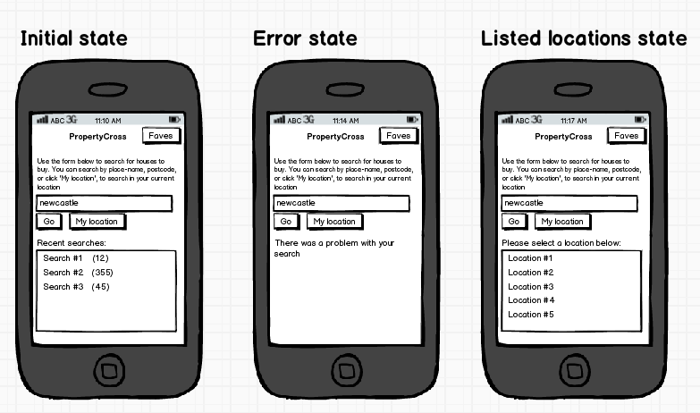
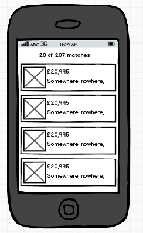
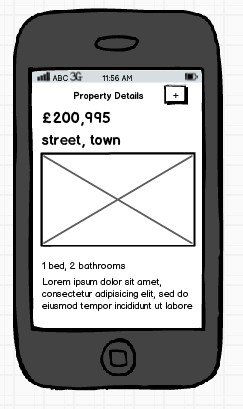
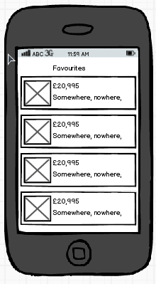

#Application Specification

This specification details the form and functionality of the PropertyCross applications. Its intended purpose is to ensure that each PropertyCross implementation is as close to the others as possible (within the constraints imposed by the implementation framework). Regarding form, this specification details the UI controls that should be included on each screen, but does not mandate a specific layout. The intention of the PropertyCross project is that each implementation should match the native look and feel of each of the target platforms (Roboto, Metro, Apple-style), hence the ambiguity regarding the exact screen layout.

PropertyCross makes use of the [Nestoria APIs](http://www.nestoria.co.uk/help/api) for searching property listings. This specification details how these APIs should be used.

##General notes

* All versions of the application should be fixed to a portrait orientation.
* Caching should be employed in order to reduce network usage when scrolling the list of search results.

##Contents

* [Property Search Page](#property-search-page)
* [Search Results Page](#search-results-page)
* [Property Listing Page](#property-listing-page)
* [Favourites Page](#favourites-page)
* [Misc](#misc)

##Property Search Page

###Form

The landing screen includes:

* Instructional text
* A text field for entry of search term
* A ‘My location’ button
* A ‘Go’ button
* A loading indicator, for iOS this is a spinner or some suitable graphics within the search field, for Windows Phone this is the standard 'crawling dots' and for Android this is a spinner within the action bar
* A region which either displays recent search terms or a list of locations to pick from. Recent searches should be displayed in chronological order and limited to 4-6 items (depending on screen size)
* A region which is used to report error messages
* A button which navigates to the favourites page

The following text is used:

* Instructional text – “Use the form below to search for houses to buy. You can search by place-name, postcode, or click 'My location', to search in your current location!”
* Heading above recent searches list – “Recent searches:”
* Heading above recent suggested locations list – “Please select a location below:”

###Function

####Initial state

When the application is launched, recent searches should be displayed and the search entry field should be empty. Each recent search should be accompanied with the number of properties it matches.

####Plain-text search

When the user enters text into the search field, then hits ‘enter’ or commits the edit, the Nestoria APIs should be queried, using the [search-listings method](http://www.nestoria.co.uk/help/api-search-listings), to find properties. An example of this search, where properties within the city of 'leeds' are searched, is given below:

    http://api.nestoria.co.uk/api?country=uk&pretty=1&action=search_listings&encoding=json&listing_type=buy&page=1&place_name=leeds
    
[open the above link in your browser](http://api.nestoria.co.uk/api?country=uk&pretty=1&action=search_listings&encoding=json&listing_type=buy&page=1&place_name=leeds)

The [Nestoria response code](http://www.nestoria.co.uk/help/api-return-codes) is processed as follows:

* `100`, `101`, `110` – the query returned a list of properties, the application should check that one or more properties were returned and navigate to the Search Results page. In the case where the location matches, but no properties were found, the page moves to the “Error state”
* `200`, `202` – the search term was ambiguous. In this case Nestoria returns a list of suggested locations. The returned list of locations should be displayed to the user as detailed in the “Listed locations state”
* Other – any other response is considered an error, the page moves to the “Error state”
The HTTP request sent to Nestoria should timeout after 5 seconds if no response is received, with the page moving to the “Error state”.

When a search is successfully executed, it should be added to the recent searches list of items as the first item. If a search is initiated by tapping a recent search item, this item should be moved to the head of the list.

####Location-based search

When the user touches the ‘My location’ button a geo-location query is sent to Nestoria. An example request is given below:

    http://api.nestoria.co.uk/api?country=uk&pretty=1&action=search_listings&encoding=json&listing_type=buy&page=1&centre_point=51.684183,-3.431481
    
[open the above link in your browser](http://api.nestoria.co.uk/api?country=uk&pretty=1&action=search_listings&encoding=json&listing_type=buy&page=1&centre_point=51.684183,-3.431481)

The response codes should be handled in the same way as the plain-text search.
 
If location is not enabled for the application, or the location cannot be found after 5 seconds, the page moves to the “Error state”.

####Listed locations state

An example of a query that returns a list of locations is given below:

    http://api.nestoria.co.uk/api?country=uk&pretty=1&action=search_listings&encoding=json&listing_type=buy&page=1&place_name=newcr
    
[open the above link in your browser](http://api.nestoria.co.uk/api?country=uk&pretty=1&action=search_listings&encoding=json&listing_type=buy&page=1&place_name=newcr)

In this state a list of suggested locations is displayed. Tapping on a location will cause the search text field to update with the text of the location and a search to be executed immediately.

NOTE: The Nestoria API locations have two different text strings associated with them, one is the human-readable text, e.g. “Albury, Guildford”, the other is the text which should be used to search for that location, e.g. “albury_guildford”, i.e. its ‘key’. Therefore, when selecting a location the the text field should display the human-readable text, but search for the location ‘key’.

If the user navigates back to the Property Search page then repeats the same search, again the location ‘key’ should be used. However, if the user edits the text within the search text field, the location ‘key’ is no longer used.

####Error state and timeouts

Both keywords and location-based search should timeout after a 5 second interval. 

When the page is in error state neither recent searches nor locations are listed. A text based error message is displayed to the user as follows:

* Zero properties returned - "There were no properties found for the given location."
* Location not matched - "The location given was not recognised."
* Network connection issues / timeout - "An error occurred while searching. Please check your network connection and try again."
* Location not enabled - "The use of location is currently disabled.”
* Location not found / timeout - "Unable to detect current location. Please ensure location is turned on in your phone settings and try again.”

In error state, the search field behaves in exactly the same way as the initial state.

##Search Results Page

###Form

The search results page displays a list of properties in the order returned by the Nestoria APIs. The style of the list presentation is flexible dependant on the platform and framework used.

The page title should indicate be of the form "x of y matches".

###Function

It should be possible to navigate from this page back to the Property Search page via a button or hardware back button depending on target platform.

When the user taps on a property listing the application navigates to the Property Listing page.

At the bottom of the list, if there are more results available, a ‘Load more’ item should be rendered. This item should bear the text "Load more … \nResults for **#search_term#**, showing **x** of **y** properties". When the user taps this item, the "Load more ..." text turns into "Loading ..." and Nestoria is queried to obtain more items, with these being added to the list.

TODO: What happens is a ‘load more’ action results in a network error?

##Property Listing Page

###Form

The listing page displays:

* The property price
* The location - Nestoria provides a ‘title’ which is a comma separated text string with multiple components. For brevity, this should be truncated to the first two title components
* An image
* The number of bedrooms and bathrooms
* The summary text
* A button to toggle favourite state

###Function

Tapping the favourites button should toggle the persisted favourite state of this property. The button should provide a clear visual indication that a property is either currently a favourite,  or not.

It should be possible to navigate from this page back to the Search Results or Favourites page via a button or hardware back button depending on target platform.

##Favourites Page

###Form

The favourites page renders a list of the properties that the user has ‘favourited’

###Function

Tapping on a property navigates to the Property Listing page.

If there are no favourites currently available, the page should display the message "You have not added any properties to your favourites".

It should be possible to navigate from this page back to the Property Search page via a button or hardware back button depending on target platform.